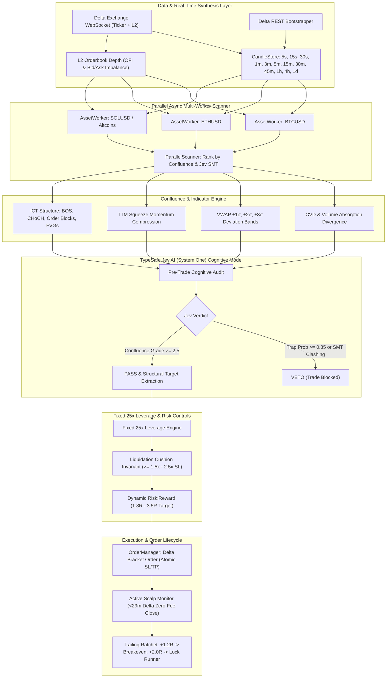

# ⚡ Delta Crypto AI Trading Bot (CLI)

[](https://www.python.org/downloads/)
[](https://opensource.org/licenses/MIT)
[](https://india.delta.exchange)
[]()
[](https://github.com/psf/black)

An institutional-grade, autonomous CLI cryptocurrency trading bot designed for **Delta Exchange India** (Crypto & Gold Futures). 

Engineered with a confluence-driven architecture combining **ICT / Smart Money Concepts**, **TypeSafe Jev AI (System One) Cognitive Reasoning**, a **Parallel Async Multi-Asset Scanner**, **Fixed 25x Leverage with Dynamic Risk:Reward Calibration**, and an interactive **Rich Terminal Dashboard UI**.

---

## 📑 Table of Contents

- [Key Capabilities](#-key-capabilities)
- [Architecture Flow](#-architecture-flow)
- [Trading Strategy: Pure Scalper Architecture](#-trading-strategy-pure-scalper-architecture)
- [11 Granular Multi-Timeframe Analysis](#-11-granular-multi-timeframe-analysis)
- [Parallel Sub-Worker Scanner Architecture](#-parallel-sub-worker-scanner-architecture)
- [Advanced Confluence Indicators](#-advanced-confluence-indicators)
- [TypeSafe Jev AI (System One) Integration](#-typesafe-jev-ai-system-one-integration)
- [Fixed 25x Leverage & Risk Management](#-fixed-25x-leverage--risk-management)
- [Installation & Quickstart](#-installation--quickstart)
- [Configuration Guide](#-configuration-guide)
  - [Environment Variables (.env)](#1-environment-variables-env)
  - [Strategy Settings (config/strategy.yaml)](#2-strategy-settings-configstrategyyaml)
  - [Risk Settings (config/risk.yaml)](#3-risk-settings-configriskyaml)
- [CLI Command Reference](#-cli-command-reference)
- [Testing & Verification](#-testing--verification)
- [Security & Environment Hardening](#-security--environment-hardening)
- [Disclaimer & License](#-disclaimer--license)

---

## 🚀 Key Capabilities

- **Native Delta Exchange India Integration**:
  - Sub-millisecond REST and WebSocket data feeds directly connected to Delta Exchange India (`api.india.delta.exchange`).
  - Supports Crypto & Commodity Futures: `BTCUSD`, `ETHUSD`, `SOLUSD`, `XAUTUSD` (Tether Gold), `PAXGUSD`, `DOGEUSD`, `XRPUSD`, `BNBUSD`, `AVAXUSD`, `ZECUSD`.
  - Automated candle bootstrapping and real-time synthesis across **11 granular timeframes**: `5s`, `15s`, `30s`, `1m`, `3m`, `5m`, `15m`, `30m`, `45m`, `1h`, `4h`, `1d`.
- **Pure Scalper Focus**:
  - Exclusively built for high-velocity scalping (max holding 15m–29m) to capitalize on intraday order flow and Delta Exchange's **0-fee maker exit offer** (positions closed under 29 minutes incur 0 maker fees on `BTCUSD` and `ETHUSD`).
- **Parallel Sub-Worker Scanner**:
  - High-throughput asynchronous `AssetWorker` agents scanning each instrument concurrently via `asyncio.gather()` and bounded with `asyncio.Semaphore`.
  - Zero-latency sorting and ranking of the most profitable confluence opportunities.
- **Fixed 25x Leverage with Dynamic Risk:Reward**:
  - Anchored leverage at **25x** for deterministic capital efficiency.
  - Dynamically calculates asymmetric profit targets ($1.8\text{R}$ up to $3.5\text{R}$) based on institutional liquidity targets and market volatility.
  - Strict liquidation cushion guarantee: liquidation distance is mathematically enforced at $\ge 1.5\times$ to $2.5\times$ the stop-loss distance.
- **Advanced Confluence Indicators**:
  - **Cumulative Volume Delta (CVD)** & absorption divergence detection.
  - **VWAP Standard Deviation Bands** ($\pm 1\sigma, \pm 2\sigma, \pm 3\sigma$).
  - **TTM Squeeze Momentum** (Bollinger Bands compression inside Keltner Channels).
  - **Order Flow Imbalance (OFI)** from live L2 orderbook bid/ask depth.
- **TypeSafe Jev AI (System One) Cognitive Copilot**:
  - **Pre-Trade Gatekeeper**: Rigorous cognitive audit evaluating trap probability ($<0.35$ filter), liquidity pools, and setup grade ($0.0$ to $4.0$).
  - **Cross-Asset SMT Divergence**: Correlates institutional smart money divergence between BTC and ETH.
  - **Active Scalp Guardian**: Sub-second health assessment (stops momentum degradation, trailing stops to breakeven at $+1.2\text{R}$, locking runners at $+2.0\text{R}$).
  - **Pattern Memory Forensics**: Local vector memory preventing repetition of historically failed setups.

---

## 📐 Architecture Flow



---

## 🎯 Trading Strategy: Pure Scalper Architecture

The bot is strictly engineered as a **Pure Scalper**:

- **Execution Focus**: Fast micro-momentum scalps and liquidity sweep reversals.
- **Maximum Holding Period**: Up to **29 minutes** to exploit Delta Exchange's **0 maker fee policy** for rapid round-trips.
- **Fixed Leverage**: **25x** across all assets, ensuring consistent risk modeling and predictability.
- **Target Risk-to-Reward**: Dynamic between **$1.8\text{R}$ and $3.5\text{R}$**, governed by key structural liquidity pools (swing highs/lows, FVGs, and volume POC).
- **Profit Protection**:
  - Trailing stop triggers at $+1.2\text{R}$ profit to ratchet SL to breakeven ($+0.1\text{R}$).
  - Locks in runner profits at $+2.0\text{R}$ with trailing ATR cushion.
  - Emergency stall protection and delta absorption exits.

---

## ⏱️ 11 Granular Multi-Timeframe Analysis

The bot analyzes market structure and momentum across 11 synchronized timeframes:

| Category | Timeframes | Purpose |
| :--- | :--- | :--- |
| **Micro Triggers** | `5s`, `15s`, `30s` | Real-time tick absorption, instant order flow sweeps, micro entry timing. |
| **Fast Execution** | `1m`, `3m`, `5m` | Primary signal trigger, displacement confirmation, Carter squeeze breakouts. |
| **Intermediate Structure** | `15m`, `30m`, `45m` | Trend structure, Order Blocks, Fair Value Gaps (FVG), Volume Profile POC. |
| **Macro Regime** | `1h`, `4h`, `1d` | Daily & weekly high/lows (PDH/PDL/PWH/PWL), Asian session range, macro bias. |

Sub-minute candles (`5s`, `15s`, `30s`) and custom granular candles (`3m`, `45m`) are synthesized in real-time by `DeltaWSClient` from streaming trade ticks and 1m/15m base candles.

---

## ⚡ Parallel Sub-Worker Scanner Architecture

To scan multiple crypto assets without blocking the event loop:
1. Each asset runs in its own **`AssetWorker`** sub-agent instance.
2. The worker computes vectorized indicators (CVD, VWAP bands, Squeeze momentum, RSI, EMA, ATR, ADX) and structural levels in parallel.
3. **`ParallelScanner`** uses `asyncio.gather()` with `asyncio.Semaphore` throttling to evaluate the entire universe simultaneously.
4. Assets are ranked by composite confluence score, and cross-asset SMT divergence (e.g. BTC vs ETH) is analyzed before capital allocation.

---

## 📊 Advanced Confluence Indicators

- **Cumulative Volume Delta (CVD)**:
  - Tracks the net aggressive buying vs selling volume intra-bar.
  - Detects **absorption divergence**: price making lower lows while CVD makes higher lows indicates institutional accumulation (bullish entry).
- **VWAP Standard Deviation Bands**:
  - Computes continuous volume-weighted average price with $\pm 1\sigma, \pm 2\sigma, \pm 3\sigma$ dispersion bands.
  - Used for mean reversion entries at statistical extremes ($\pm 2\sigma$ or $\pm 3\sigma$) and dynamic trailing targets.
- **TTM Squeeze Momentum Oscillator**:
  - Identifies volatility compression when Bollinger Bands (20, 2.0) contract inside Keltner Channels (20, 1.5).
  - Fires explosive directional scalp entries when the squeeze releases.
- **Order Flow Imbalance (OFI)**:
  - Real-time bid/ask depth evaluation from Delta's L2 orderbook.
  - Blocks entries if the order book is skewed against the trade direction.

---

## 🧠 TypeSafe Jev AI (System One) Integration

Unlike conventional trading bots that rely solely on lagging indicators or rigid rules, this system utilizes **TypeSafe Jev AI (System One)** as an autonomous cognitive copilot:

1. **Pre-Trade Gatekeeper**:
   - Queries Jev's sub-second typed reasoning API with full market state (4H macro bias, 1H structure, dealing range, L2 orderbook imbalance, SMT divergence, volatility, and volume).
   - Rejects entries when fakeout/trap probability exceeds $35\%$.
   - Assigns setup grades from $0.0$ to $4.0$ (trades requiring $\ge 2.5$ for execution).
2. **Dynamic Stop-Loss & Take-Profit Maintenance**:
   - Eliminates arbitrary percentage-based targets.
   - Places stops beyond institutional invalidation points (Order Block extremes, swing wicks) and targets opposing liquidity pools with a mathematical guarantee of $\ge 2.5\text{R}$.
3. **Active Trade Monitoring**:
   - Evaluates open positions every 5 seconds for momentum stalling, delta absorption, or institutional reversal candles.
   - Automatically executes flat scratch exits when the trading thesis is invalidated.
4. **Continuous Learning & Mistake Forensics**:
   - When a trade hits a stop loss, Jev diagnoses the root cause (e.g., `LIQUIDITY_RUN`, `CHOP_EXPANSION`, `NEWS_SPIKE`).
   - Stores the 20-dimensional market fingerprint into `data/patterns/losing_mistake_patterns.json` so the bot never repeats the same mistake twice.

---

## 🛡️ Fixed 25x Leverage & Dynamic Risk Controls

Trading crypto derivatives requires rigorous capital preservation. The bot enforces strict mathematical risk limits:

- **Fixed 25x Leverage Architecture**:
  - Leverage is deterministic and anchored to **25x** (`fixed_leverage = 25`).
  - Eliminates uncontrolled leverage spikes while maximizing buying power efficiency within Delta Exchange's initial margin rules.
  - Position sizing is dynamically calculated so total margin per trade does not exceed the configured capital allocation limit (default 80%, leaving 20% untouchable reserve).

- **Dynamic Risk-to-Reward (1.8R to 3.5R)**:
  - Rather than scaling leverage up or down, the bot dynamically scales its **Risk:Reward targets**:
    - **High-Velocity Micro Scenarios**: Targets nearest liquidity pool or EMA/VWAP confluence at $1.8\text{R}$ to $2.2\text{R}$.
    - **Structural Breakout & Trend Continuation**: Targets opposing institutional Order Blocks or Volume POC at $2.5\text{R}$ up to $3.5\text{R}$.

- **Liquidation Cushion Invariant**:
  $$\text{Liquidation Distance} \ge 1.5 \times \text{Stop Loss Distance}$$
  - A trade is rejected if the distance from entry to estimated liquidation price does not provide at least a $1.5\times$ (up to $2.5\times$) cushion beyond the stop-loss price.

- **Circuit Breakers**:
  - **Max Daily Loss**: Trading terminates automatically if portfolio equity draws down by $\ge 3.0\%$ in 24 hours.
  - **Consecutive Loss Cooldown**: Enforces a 5-minute timeout after consecutive losing trades.
  - **Orderbook Imbalance (OBI) Filter**: Aborts entries if the opposing side of the order book carries $>65\%$ depth imbalance.
  - **Exchange Bracket Orders**: Every trade places native Stop Loss and Take Profit orders directly on Delta Exchange at submission time.

---

## 📦 Installation & Quickstart

### Prerequisites
- **Python 3.11** or higher
- **Git**
- Recommended: [uv](https://github.com/astral-sh/uv) (ultra-fast Python package manager) or standard `pip`

### Step 1: Clone the Repository
```bash
git clone https://github.com/adarshvermaa/trading_bot.git
cd trading_bot
```

### Step 2: Create Virtual Environment
Using `uv`:
```bash
uv venv
source .venv/bin/activate
```
Or using standard `python`:
```bash
python3 -m venv .venv
source .venv/bin/activate
```

### Step 3: Install Dependencies
```bash
pip install -e .
```
Or with developer/testing dependencies:
```bash
pip install -e ".[dev]"
```

### Step 4: Configure Environment Credentials
Copy the `.env.example` template:
```bash
cp .env.example .env
```
Open `.env` and configure your credentials:
```bash
nano .env  # or vim, code, etc.
```

---

## ⚙️ Configuration Guide

### 1. Environment Variables (`.env`)

| Variable | Description | Default | Required |
| :--- | :--- | :---: | :---: |
| `DELTA_API_KEY` | Delta Exchange API Key | *Empty* | Yes (for trading & private data) |
| `DELTA_API_SECRET` | Delta Exchange API Secret | *Empty* | Yes (for trading & private data) |
| `DELTA_API_URL` | Delta Exchange REST API base URL | `https://api.india.delta.exchange` | Yes |
| `DELTA_WS_URL` | Delta Exchange WebSocket URL | `wss://socket.india.delta.exchange` | Yes |
| `JEV_API_KEY` | TypeSafe Jev AI (System One) API key | *Empty* | Optional (uses local heuristics if empty) |
| `LITELLM_API_KEY` | LiteLLM API Key (OpenAI, Anthropic, etc.) | *Empty* | Optional |
| `LITELLM_MODEL` | LiteLLM model identifier | `gpt-4o-mini` | Optional |
| `LIVE_TRADING` | Master safety switch (`true` or `false`) | `false` | **Crucial** (`true` enables live money) |
| `LOG_LEVEL` | Log verbosity (`DEBUG`, `INFO`, `WARNING`, `ERROR`) | `INFO` | No |
| `LOG_DIR` | Output directory for structured JSON logs | `logs` | No |

### 2. Strategy Settings (`config/strategy.yaml`)
- `profile`: Strictly anchored to `scalp`.
- `assets.universe`: Default list of scanned/traded instruments (e.g. `BTCUSD`, `ETHUSD`, `SOLUSD`).
- `timeframes`: Full 11-timeframe hierarchy (`5s`, `15s`, `30s`, `1m`, `3m`, `5m`, `15m`, `30m`, `45m`, `1h`, `4h`, `1d`).
- `parallel_scanner`: Max concurrent worker sub-agents (`max_concurrent_workers: 10`) and confluence weights.
- `indicators`: Config for EMA, RSI, ATR, ADX, CVD, VWAP standard deviation bands, and TTM Squeeze momentum.
- `structure`: ICT swing lookbacks, wick sweep ratio, displacement threshold.
- `jev`: Model timeout, min confidence, max trap probability ($0.35$), dynamic R:R switches.

### 3. Risk Settings (`config/risk.yaml`)
- `capital.max_allocation_pct`: Maximum portfolio capital deployed per trade (e.g. `0.80` = 80%).
- `capital.reserve_pct`: Untouchable reserve buffer (e.g. `0.20` = 20%).
- `leverage.fixed_leverage`: Anchored fixed leverage (`25x`).
- `dynamic_leverage.liquidation_buffer_ratio`: Safety cushion multiplier relative to stop loss ($\ge 1.5\times$ to $2.5\times$).
- `daily_limits.max_daily_loss_pct`: Portfolio daily loss limit (`0.03` = 3%).

---

## 💻 CLI Command Reference

The bot can be executed directly via the installed `crypto-scalper` command, `python -m src.main`, or the bundled `./run_bot.sh` helper.

### 1. Paper Simulation Mode (Safe Default)
Runs the complete trading engine, streaming real-time Delta market data, synthesizing multi-timeframe candles, and simulating execution with virtual capital:
```bash
# Using CLI binary
crypto-scalper --mode paper --paper-balance 10000

# Or using runner script
./run_bot.sh paper
```

### 2. Parallel Market Scanner Mode
Executes a high-throughput parallel scan across all target assets via asynchronous `AssetWorker` instances, evaluates CVD/VWAP/Squeeze confluence, runs Jev AI audits, and displays the top actionable setups:
```bash
# Scan default top 10 assets concurrently
crypto-scalper --mode scan

# Scan specific custom assets in parallel
crypto-scalper --mode scan --symbols BTCUSD,ETHUSD,SOLUSD,XAUTUSD

# Scan a preset universe
crypto-scalper --mode scan --universe top10
```

### 3. Live Trading Mode (REAL MONEY)
Executes real orders on Delta Exchange India with fixed 25x leverage and bracket stops. Requires `LIVE_TRADING=true` in `.env` and an interactive confirmation prompt:
```bash
crypto-scalper --mode live

# For automated environments (skips interactive confirmation):
crypto-scalper --mode live --yes
```

### 4. Account Status & Connectivity Check
Verifies exchange REST credentials, WebSocket connection, account equity, and margin balance:
```bash
crypto-scalper --mode status
# or
./run_bot.sh status
```

### 5. Emergency Kill Switch
Immediately cancels all resting orders and closes open positions:
```bash
crypto-scalper --kill-switch
# or
./run_bot.sh kill
```

### Complete CLI Options
```
usage: crypto-scalper [-h] [--mode {paper,live,scan,status,backtest}]
                      [--config-dir CONFIG_DIR] [--log-level {DEBUG,INFO,WARNING,ERROR}]
                      [--kill-switch] [--paper-balance PAPER_BALANCE]
                      [--universe UNIVERSE] [--symbols SYMBOLS] [-y]

Options:
  -h, --help            Show help message and exit
  --mode {paper,live,scan,status,backtest}
                        Operating mode (default: paper)
  --config-dir CONFIG_DIR
                        Path to config directory (default: config/)
  --log-level {DEBUG,INFO,WARNING,ERROR}
                        Override log level from .env
  --kill-switch         Activate emergency kill switch on start
  --paper-balance PAPER_BALANCE
                        Starting balance for paper trading (default: 10000)
  --universe UNIVERSE   Universe preset to scan/trade (e.g. 'majors', 'top10', 'gold')
  --symbols SYMBOLS     Comma-separated custom symbols (e.g. 'BTCUSD,SOLUSD,XAUTUSD')
  -y, --yes             Skip interactive confirmation prompt for live trading
```

---

## 🧪 Testing & Verification

The bot includes an extensive automated test suite covering all modules:

```bash
# Run full test suite
pytest -v

# Run with coverage report
pytest --cov=src -v

# Run specifically the session swing & Jev tests
pytest tests/test_session_swing.py tests/test_dynamic_leverage.py -v
```

### Delta Exchange Verification Script
To verify Delta Exchange API credentials, wallet balances, product specifications, and precision tick rounding without placing live orders:
```bash
python scripts/verify_delta_execution.py --dry-run
```

---

## 🔒 Security & Environment Hardening

When publishing or deploying this repository, strict security precautions are enforced:

1. **`.env` is Strictly Ignored**:
   - `.gitignore` is hardened with glob patterns (`.env`, `.env.*`, `*.env`) to prevent any credential file from ever entering version control.
   - `.env.example` contains only dummy placeholders (`your_delta_api_key_here`).
2. **No API Secret Logging**:
   - `EnvConfig` implements custom `__repr__` masking so API keys and secrets are never printed in terminal outputs or log files.
3. **API Key Permissions**:
   - Create API keys on Delta Exchange India with **Read** and **Trade** permissions only.
   - **NEVER** enable **Withdrawal** permissions on API keys used for automated trading.
4. **Fail-Safe Defaults**:
   - `LIVE_TRADING` defaults to `false`.
   - The bot aborts immediately if `live` mode is requested while `LIVE_TRADING=false`.

---

## 📄 Disclaimer & License

### Financial Disclaimer
> **Warning**: Cryptocurrency and derivatives trading carries substantial financial risk and is not suitable for every investor. The valuation of futures contracts may fluctuate rapidly, and losses can exceed the initial margin deposit. This software is provided for educational and research purposes only. The authors and contributors bear no responsibility for financial losses incurred through the use of this software. Always test thoroughly in paper trading mode before committing capital.

### License
This project is open-source and licensed under the [MIT License](LICENSE).