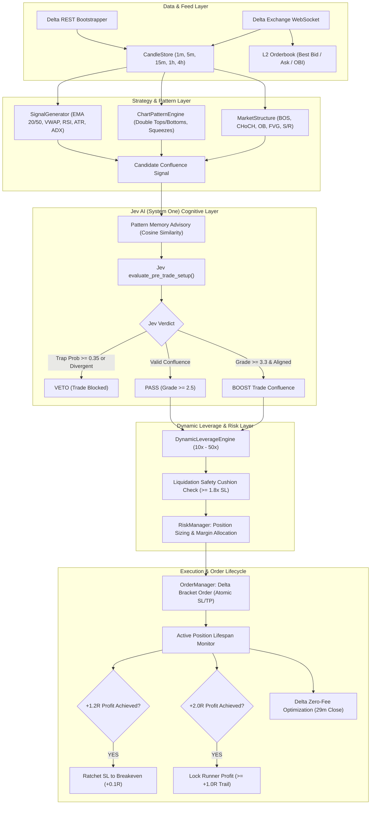

# ⚡ Delta Crypto AI Trading Bot (CLI)

[](https://www.python.org/downloads/)
[](https://opensource.org/licenses/MIT)
[](https://india.delta.exchange)
[]()
[](https://github.com/psf/black)

An institutional-grade, autonomous CLI cryptocurrency trading bot designed for **Delta Exchange India** (Crypto & Gold Futures). 

Engineered with a confluence-driven architecture combining **ICT / Smart Money Concepts**, a **TradingView Chart Pattern Engine**, **TypeSafe Jev AI (System One) Cognitive Reasoning**, **Dynamic Leverage (10x–50x)**, and an interactive **Rich Terminal Dashboard UI**.

---

## 📑 Table of Contents

- [Key Capabilities](#-key-capabilities)
- [Architecture Flow](#-architecture-flow)
- [Trading Strategy & Profiles](#-trading-strategy--profiles)
- [TypeSafe Jev AI (System One) Integration](#-typesafe-jev-ai-system-one-integration)
- [Dynamic Leverage & Risk Controls](#-dynamic-leverage--risk-controls)
- [Installation & Quickstart](#-installation--quickstart)
- [Configuration Guide](#-configuration-guide)
  - [Environment Variables (.env)](#1-environment-variables-env)
  - [Strategy Settings (config/strategy.yaml)](#2-strategy-settings-configstrategyyaml)
  - [Risk Settings (config/risk.yaml)](#3-risk-settings-configriskyaml)
- [CLI Command Reference](#-cli-command-reference)
- [Testing & Verification](#-testing--verification)
- [Security & Environment Hardening](#-security--environment-hardening)
- [Disclaimer & License](#-disclaimer--license)

---

## 🚀 Key Capabilities

- **Native Delta Exchange India Integration**:
  - Sub-millisecond REST and WebSocket data feeds directly connected to Delta Exchange India (`api.india.delta.exchange`).
  - Supports Crypto & Commodity Futures: `BTCUSD`, `ETHUSD`, `SOLUSD`, `XAUTUSD` (Tether Gold), `PAXGUSD`, `DOGEUSD`, `XRPUSD`, `BNBUSD`, `AVAXUSD`, `ZECUSD`.
  - Automated candle bootstrapping up to 24,000 historical candles across 1m, 5m, 15m, 1h, and 4h timeframes.
- **ICT & Smart Money Concepts Engine**:
  - **Market Structure**: Multi-timeframe Break of Structure (BOS), Change of Character (CHoCH), and swing high/low tracking.
  - **Institutional Zones**: Order Blocks (OB), Fair Value Gaps (FVG), Volume Point of Control (POC), Value Area High/Low (VAH/VAL), Equal Highs/Lows (EQH/EQL), and Asian Session Range (00:00–08:00 UTC).
  - **Dealing Range Matrix**: Algorithmic classification into **DISCOUNT** ($<45\%$, institutional buying), **PREMIUM** ($>55\%$, institutional selling), or **EQUILIBRIUM**.
- **TradingView Chart Pattern Engine**:
  - Algorithmic recognition of classic price action patterns: **Double Bottom (W)**, **Double Top (M)**, **Head & Shoulders**, **Inverse H&S**, and **Carter Volatility Squeezes** (Bollinger inside Keltner Channel compression).
  - Four institutional playbooks: `ICT_JUDAS_SWEEP`, `ORDER_BLOCK_FVG_PULLBACK`, `CARTER_SQUEEZE_BREAKOUT`, and `VALUE_AREA_MEAN_REVERSION`.
- **TypeSafe Jev AI (System One) Cognitive Model**:
  - **Pre-Trade Gatekeeper**: Analyzes macro narrative, structure integrity, trap probability ($<0.35$ filter), and setup grade ($0.0$ to $4.0$).
  - **Asymmetric Targets**: Dynamically calibrates structural take-profit and stop-loss targets with guaranteed $\ge 2.5\text{R}$ up to $5.0\text{R}$ multiples.
  - **Active Trade Guardian**: Continuously monitors trade health, momentum degradation, and structural breakdown to trigger emergency cuts.
  - **Pattern Memory & Forensics**: Automatically fingerprints winning and losing trades into a local vector database to prevent repeating historical mistakes.
- **Dynamic Leverage Engine**:
  - Dynamic position sizing and leverage calibration across 4 tiers: **Win-Win Apex (50x)**, **High Conviction (30x)**, **Standard Scalp (20x)**, and **Defensive Probe (10x)**.
  - **Liquidation Cushion Guarantee**: Enforces that liquidation distance is strictly $\ge 1.5\times$ to $1.8\times$ the stop-loss distance.
- **Rich Terminal Dashboard UI**:
  - Interactive live dashboard featuring real-time multi-asset ranking, radar technical matrix, SMT cross-asset divergence alerts, orderbook imbalance (OBI), and live unrealized PnL.

---

## 📐 Architecture Flow



---

## 🎯 Trading Strategy & Profiles

The bot supports two distinct operational profiles configurable via CLI (`--profile`) or `config/strategy.yaml`:

### 1. High-Frequency Scalp Profile (`scalp`)
- **Focus**: Fast session momentum scalping on 1m, 5m, and 15m charts.
- **Holding Window**: 3 to 29 minutes.
- **Target R:R**: $1.5\text{R}$ to $2.5\text{R}$.
- **Delta Fee Arbitrage**: Optimizes trade closes before 29 minutes on `BTCUSD` and `ETHUSD` to take advantage of Delta Exchange's zero-fee maker closing offer.
- **Dynamic Leverage**: Up to **50x** on highest-conviction apex setups.

### 2. Intraday Session Swing Profile (`intraday_swing`)
- **Focus**: Institutional session expansion moves across London and New York sessions.
- **Timeframe Hierarchy**:
  - **4H/1D Macro Context**: Macro trend and dealing range positioning (**DISCOUNT** vs **PREMIUM**).
  - **1H Intermediate Structure**: Institutional Order Blocks, Fair Value Gaps, and BOS confirmations.
  - **5m/15m Precision Trigger**: Key level liquidity sweeps paired with $>70\%$ body-to-range displacement candles.
- **Holding Window**: Strictly **1 hour (60m) minimum** up to **8 hours (480m) maximum**.
- **1-Hour Thesis Immunity**: Suppresses premature micro-pullback momentum exits during the first 60 minutes, ensuring institutional expansion has room to develop while structural stop loss remains strictly enforced.
- **8-Hour Sunset Close (`SESSION_8H_SUNSET_EXPIRY`)**: Flags warning at 7.5 hours and forces a flat exit at 8.0 hours to avoid multi-day exposure and Delta 8-hour funding rate resets.
- **Target R:R**: Asymmetric $\ge 2.5\text{R}$ up to $4.0\text{R}$.
- **Dynamic Leverage**: Conservative **10x to 25x safe cushion**.

---

## 🧠 TypeSafe Jev AI (System One) Integration

Unlike conventional trading bots that rely solely on lagging indicators or rigid rules, this system utilizes **TypeSafe Jev AI (System One)** as an autonomous cognitive copilot:

1. **Pre-Trade Gatekeeper**:
   - Queries Jev's sub-second typed reasoning API with full market state (4H macro bias, 1H structure, dealing range, L2 orderbook imbalance, SMT divergence, volatility, and volume).
   - Rejects entries when fakeout/trap probability exceeds $35\%$.
   - Assigns setup grades from $0.0$ to $4.0$ (trades requiring $\ge 2.5$ for execution).
2. **Dynamic Stop-Loss & Take-Profit Maintenance**:
   - Eliminates arbitrary percentage-based targets.
   - Places stops beyond institutional invalidation points (Order Block extremes, swing wicks) and targets opposing liquidity pools with a mathematical guarantee of $\ge 2.5\text{R}$.
3. **Active Trade Monitoring**:
   - Evaluates open positions every 5 seconds for momentum stalling, delta absorption, or institutional reversal candles.
   - Automatically executes flat scratch exits when the trading thesis is invalidated.
4. **Continuous Learning & Mistake Forensics**:
   - When a trade hits a stop loss, Jev diagnoses the root cause (e.g., `LIQUIDITY_RUN`, `CHOP_EXPANSION`, `NEWS_SPIKE`).
   - Stores the 20-dimensional market fingerprint into `data/patterns/losing_mistake_patterns.json` so the bot never repeats the same mistake twice.

---

## 🛡️ Dynamic Leverage & Risk Controls

Trading crypto derivatives requires rigorous capital preservation. The bot enforces strict mathematical risk limits:

- **Dynamic Leverage Matrix**:
  | Tier | Leverage Range | Minimum Confluence | Required Cushion |
  | :--- | :---: | :---: | :---: |
  | **Win-Win Apex** | 40x – 50x (Scalp) / 25x (Swing) | $\ge 90\%$ Confluence + Jev Boost | $\ge 1.8\times$ SL Distance |
  | **High Conviction**| 25x – 35x (Scalp) / 20x (Swing) | $\ge 80\%$ Confluence | $\ge 1.8\times$ SL Distance |
  | **Standard** | 15x – 20x (Scalp) / 15x (Swing) | $\ge 70\%$ Confluence | $\ge 1.6\times$ SL Distance |
  | **Defensive Probe**| 5x – 10x | $\ge 60\%$ Confluence | $\ge 1.5\times$ SL Distance |

- **Liquidation Cushion Formula**:
  $$\text{Liquidation Distance} \ge 1.8 \times \text{Stop Loss Distance}$$
  If calculated leverage places the liquidation price inside this safety buffer, leverage is automatically dialed down to the safest compliant tier.
- **Circuit Breakers**:
  - **Max Daily Loss**: Trading terminates automatically if portfolio equity draws down by $\ge 3.0\%$ in 24 hours.
  - **Consecutive Loss Cooldown**: Enforces a 5-minute timeout after consecutive losing trades.
  - **Orderbook Imbalance (OBI) Filter**: Aborts entries if the opposing side of the order book carries $>65\%$ depth imbalance.
  - **Exchange Bracket Orders**: Every trade places native Stop Loss and Take Profit orders directly on Delta Exchange at submission time.

---

## 📦 Installation & Quickstart

### Prerequisites
- **Python 3.11** or higher
- **Git**
- Recommended: [uv](https://github.com/astral-sh/uv) (ultra-fast Python package manager) or standard `pip`

### Step 1: Clone the Repository
```bash
git clone https://github.com/adarshvermaa/trading_bot.git
cd trading_bot
```

### Step 2: Create Virtual Environment
Using `uv`:
```bash
uv venv
source .venv/bin/activate
```
Or using standard `python`:
```bash
python3 -m venv .venv
source .venv/bin/activate
```

### Step 3: Install Dependencies
```bash
pip install -e .
```
Or with developer/testing dependencies:
```bash
pip install -e ".[dev]"
```

### Step 4: Configure Environment Credentials
Copy the `.env.example` template:
```bash
cp .env.example .env
```
Open `.env` and configure your credentials:
```bash
nano .env  # or vim, code, etc.
```

---

## ⚙️ Configuration Guide

### 1. Environment Variables (`.env`)

| Variable | Description | Default | Required |
| :--- | :--- | :---: | :---: |
| `DELTA_API_KEY` | Delta Exchange API Key | *Empty* | Yes (for trading & private data) |
| `DELTA_API_SECRET` | Delta Exchange API Secret | *Empty* | Yes (for trading & private data) |
| `DELTA_API_URL` | Delta Exchange REST API base URL | `https://api.india.delta.exchange` | Yes |
| `DELTA_WS_URL` | Delta Exchange WebSocket URL | `wss://socket.india.delta.exchange` | Yes |
| `JEV_API_KEY` | TypeSafe Jev AI (System One) API key | *Empty* | Optional (uses local heuristics if empty) |
| `LITELLM_API_KEY` | LiteLLM API Key (OpenAI, Anthropic, etc.) | *Empty* | Optional |
| `LITELLM_MODEL` | LiteLLM model identifier | `gpt-4o-mini` | Optional |
| `LIVE_TRADING` | Master safety switch (`true` or `false`) | `false` | **Crucial** (`true` enables live money) |
| `LOG_LEVEL` | Log verbosity (`DEBUG`, `INFO`, `WARNING`, `ERROR`) | `INFO` | No |
| `LOG_DIR` | Output directory for structured JSON logs | `logs` | No |

### 2. Strategy Settings (`config/strategy.yaml`)
- `profile`: Sets default active profile (`scalp` or `intraday_swing`).
- `assets.universe`: Default list of scanned/traded instruments.
- `assets.presets`: Presets such as `majors` (BTC, ETH), `top10` (top 10 liquid crypto + gold), and `gold` (XAUT, PAXG).
- `structure`: ICT swing lookbacks, wick sweep ratio, displacement threshold.
- `breakout`: Bollinger & Keltner squeeze parameters, runner trailing targets.
- `jev`: Model timeout, min confidence, max trap probability, dynamic SL/TP switches.

### 3. Risk Settings (`config/risk.yaml`)
- `capital.max_allocation_pct`: Maximum portfolio capital deployed per trade (e.g. `0.80` = 80%).
- `leverage.high_leverage_value`: Base target leverage.
- `dynamic_leverage.tiers`: Max leverage for each confluence tier.
- `dynamic_leverage.liquidation_buffer_ratio`: Safety cushion multiplier relative to stop loss.
- `daily_limits.max_daily_loss_pct`: Portfolio daily loss limit (`0.03` = 3%).

---

## 💻 CLI Command Reference

The bot can be executed directly via the installed `crypto-scalper` command, `python -m src.main`, or the bundled `./run_bot.sh` helper.

### 1. Paper Simulation Mode (Safe Default)
Runs the complete trading engine, streaming real-time Delta market data and simulating execution with virtual capital:
```bash
# Using CLI binary
crypto-scalper --mode paper --paper-balance 10000

# Or using runner script
./run_bot.sh paper
```

### 2. Market Scanner Mode
Executes a one-shot multi-timeframe scan across all target assets, evaluates ICT market structure, runs Jev AI audits, and displays the top actionable setups:
```bash
# Scan default top 10 assets
crypto-scalper --mode scan

# Scan specific custom assets
crypto-scalper --mode scan --symbols BTCUSD,ETHUSD,SOLUSD,XAUTUSD

# Scan a preset universe
crypto-scalper --mode scan --universe gold
```

### 3. Intraday Session Swing Mode
Launches the bot with the 1H–8H holding horizon, 4H/1D macro bias, and 1-hour thesis immunity window:
```bash
crypto-scalper --mode paper --profile intraday_swing --symbols BTCUSD,ETHUSD
```

### 4. Live Trading Mode (REAL MONEY)
Executes real orders on Delta Exchange India. Requires `LIVE_TRADING=true` in `.env` and an interactive confirmation prompt:
```bash
crypto-scalper --mode live

# For automated environments (skips interactive confirmation):
crypto-scalper --mode live --yes
```

### 5. Account Status & Connectivity Check
Verifies exchange REST credentials, WebSocket connection, account equity, and margin balance:
```bash
crypto-scalper --mode status
# or
./run_bot.sh status
```

### 6. Emergency Kill Switch
Immediately cancels all resting orders and closes open positions:
```bash
crypto-scalper --kill-switch
# or
./run_bot.sh kill
```

### Complete CLI Options
```
usage: crypto-scalper [-h] [--mode {paper,live,scan,status,backtest}]
                      [--profile {scalp,intraday_swing}]
                      [--config-dir CONFIG_DIR] [--log-level {DEBUG,INFO,WARNING,ERROR}]
                      [--kill-switch] [--paper-balance PAPER_BALANCE]
                      [--universe UNIVERSE] [--symbols SYMBOLS] [-y]

Options:
  -h, --help            Show help message and exit
  --mode {paper,live,scan,status,backtest}
                        Operating mode (default: paper)
  --profile {scalp,intraday_swing}
                        Strategy profile to execute (default: scalp)
  --config-dir CONFIG_DIR
                        Path to config directory (default: config/)
  --log-level {DEBUG,INFO,WARNING,ERROR}
                        Override log level from .env
  --kill-switch         Activate emergency kill switch on start
  --paper-balance PAPER_BALANCE
                        Starting balance for paper trading (default: 10000)
  --universe UNIVERSE   Universe preset to scan/trade (e.g. 'majors', 'top10', 'gold')
  --symbols SYMBOLS     Comma-separated custom symbols (e.g. 'BTCUSD,SOLUSD,XAUTUSD')
  -y, --yes             Skip interactive confirmation prompt for live trading
```

---

## 🧪 Testing & Verification

The bot includes an extensive automated test suite covering all modules:

```bash
# Run full test suite
pytest -v

# Run with coverage report
pytest --cov=src -v

# Run specifically the session swing & Jev tests
pytest tests/test_session_swing.py tests/test_dynamic_leverage.py -v
```

### Delta Exchange Verification Script
To verify Delta Exchange API credentials, wallet balances, product specifications, and precision tick rounding without placing live orders:
```bash
python scripts/verify_delta_execution.py --dry-run
```

---

## 🔒 Security & Environment Hardening

When publishing or deploying this repository, strict security precautions are enforced:

1. **`.env` is Strictly Ignored**:
   - `.gitignore` is hardened with glob patterns (`.env`, `.env.*`, `*.env`) to prevent any credential file from ever entering version control.
   - `.env.example` contains only dummy placeholders (`your_delta_api_key_here`).
2. **No API Secret Logging**:
   - `EnvConfig` implements custom `__repr__` masking so API keys and secrets are never printed in terminal outputs or log files.
3. **API Key Permissions**:
   - Create API keys on Delta Exchange India with **Read** and **Trade** permissions only.
   - **NEVER** enable **Withdrawal** permissions on API keys used for automated trading.
4. **Fail-Safe Defaults**:
   - `LIVE_TRADING` defaults to `false`.
   - The bot aborts immediately if `live` mode is requested while `LIVE_TRADING=false`.

---

## 📄 Disclaimer & License

### Financial Disclaimer
> **Warning**: Cryptocurrency and derivatives trading carries substantial financial risk and is not suitable for every investor. The valuation of futures contracts may fluctuate rapidly, and losses can exceed the initial margin deposit. This software is provided for educational and research purposes only. The authors and contributors bear no responsibility for financial losses incurred through the use of this software. Always test thoroughly in paper trading mode before committing capital.

### License
This project is open-source and licensed under the [MIT License](LICENSE).